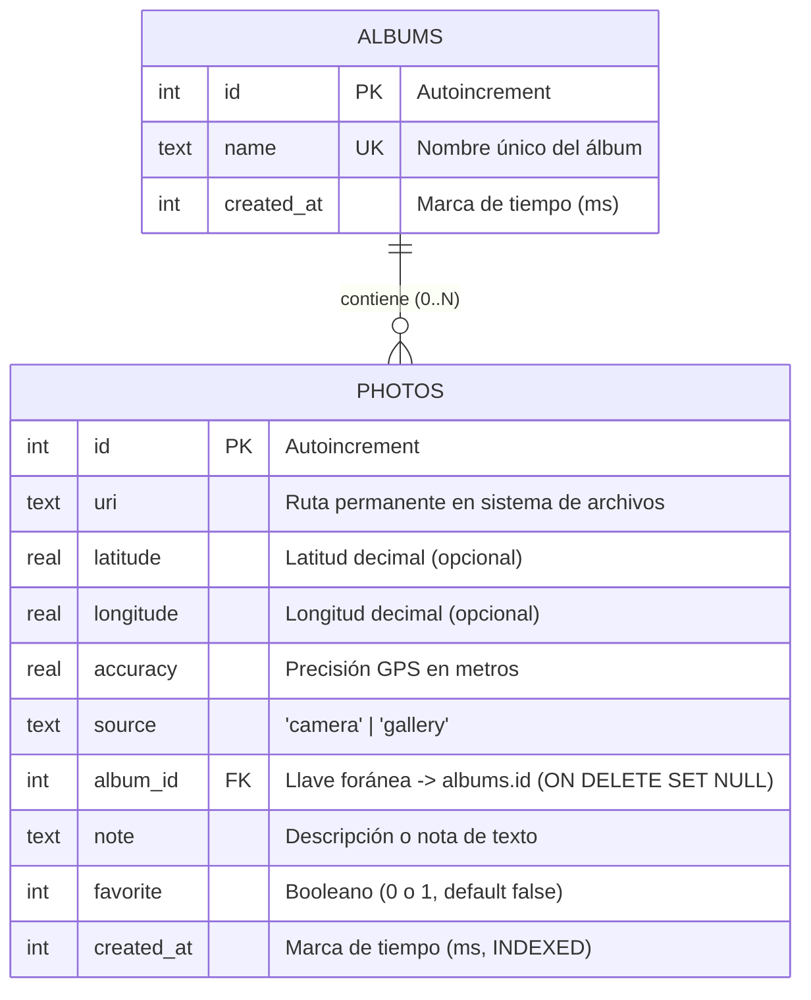
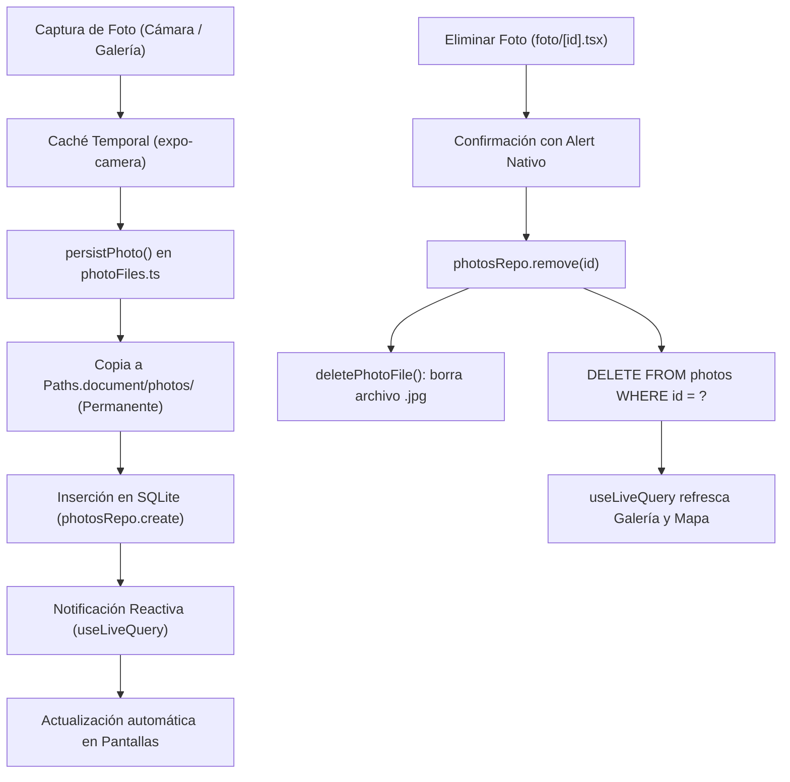

# GeoCam – Base de Datos Local Offline-First con Drizzle ORM y SQLite

Aplicación móvil desarrollada con **Expo SDK 57**, **React Native**, **expo-sqlite** y **Drizzle ORM**. Implementa una arquitectura **Offline-First** por capas donde las fotos y sus coordenadas GPS sobreviven al cierre de la aplicación, soportando relaciones entre tablas, persistencia en sistema de archivos permanente, consultas reactivas en tiempo real (`useLiveQuery`) y un módulo CRUD completo con filtros avanzados.

---

## 🏛️ Arquitectura por Capas (Separación de Responsabilidades)

El flujo de datos sigue un desacoplamiento estricto de cinco capas, garantizando que la interfaz gráfica nunca interactúe directamente con el motor de base de datos ni conozca los detalles de las consultas SQL:

```
┌──────────────────────────────────────────────────────────┐
│ 1. Pantallas UI (src/app/)                                │
│    - geocam.tsx       (Captura y preview de cámara)      │
│    - galeria.tsx      (Lista reactiva, filtros, búsqueda)│
│    - mapa.tsx         (Pines GPS, carrusel geolocalizado)│
│    - foto/[id].tsx    (Edición CRUD, notas, álbumes)     │
└────────────────────────────┬─────────────────────────────┘
                             │ (Eventos y Estado Reactivo)
┌────────────────────────────▼─────────────────────────────┐
│ 2. Hooks Reactivos (src/hooks/)                          │
│    - usePhotos.ts     (useLiveQuery, addPhoto, remove)   │
│    - useAlbums.ts     (useLiveQuery, createAlbum)        │
│    - useShake.ts      (Detección de sacudida para clear) │
└────────────────────────────┬─────────────────────────────┘
                             │ (Consultas y Mutaciones)
┌────────────────────────────▼─────────────────────────────┐
│ 3. Repositorios de Datos (src/db/repositories/)          │
│    - photos.ts        (listQuery, withLocation, CRUD)    │
│    - albums.ts        (listQuery, create, remove)        │
└────────────────────────────┬─────────────────────────────┘
                             │ (Type-Safe SQL Generado)
┌────────────────────────────▼─────────────────────────────┐
│ 4. Drizzle ORM & Esquema (src/db/)                       │
│    - schema.ts        (Modelado relacional y tipos)      │
│    - client.ts        (expoDb, PRAGMA foreign_keys = ON) │
│    - services/photoFiles.ts (expo-file-system permanente)│
└────────────────────────────┬─────────────────────────────┘
                             │ (I/O SQLite & Archivos)
┌────────────────────────────▼─────────────────────────────┐
│ 5. expo-sqlite & FileSystem                              │
│    - geocam.db        (Base relacional en disco)         │
│    - Paths.document   (Almacenamiento permanente JPG)    │
└──────────────────────────────────────────────────────────┘
```

---

## 📊 Diagrama Entidad-Relación (ERD)

La base de datos relacional modela la relación de **Uno a Muchos** entre álbumes y fotos, con protección de integridad referencial:



### Reglas de Integridad Referencial:
- **`ON DELETE SET NULL`:** Al eliminar un álbum (`albums`), las fotos asociadas **no se eliminan**; su columna `album_id` pasa automáticamente a `NULL` preservando los recuerdos del usuario.
- **`PRAGMA foreign_keys = ON;`:** Se inicializa en `src/db/client.ts` para obligar al motor SQLite nativo a aplicar las restricciones de llaves foráneas en cada conexión.
- **Índice de rendimiento:** Índice `photos_created_at_idx` sobre `photos.created_at` para optimizar consultas de paginación y ordenamiento descendente.

---

## 🔄 Flujo de Datos y Ciclo de Vida de Fotos



---

## 📁 Migraciones Versionadas (`drizzle/`)

Las migraciones fueron generadas de manera secuencial y estricta mediante `npx drizzle-kit generate` (sin edición manual):

1. **`0000_chunky_amazoness.sql` (Taller en clase):**
   - Creación de la tabla `photos` con campos `id`, `uri`, `latitude`, `longitude`, `accuracy`, `source`, `created_at`.
2. **`0001_skinny_shriek.sql` (Trabajo para la casa):**
   - Creación de la tabla `albums` con restricción de unicidad en `name`.
   - Adición de columnas en `photos`: `album_id` (FK a `albums.id`), `note` (texto) y `favorite` (booleano con valor predeterminado `false`).
3. **`0002_black_ultragirl.sql` (Reto opcional):**
   - Creación del índice `photos_created_at_idx` sobre `photos(created_at)`.
4. **`migrations.js`:** Archivo índice generado automáticamente para el bundle de Expo mediante `driver: 'expo'`.

---

## 🚀 Funcionalidades Implementadas

### 1. Taller en Clase (T1 – T6)
- [x] **T1. Configuración:** Dependencias `expo-sqlite`, `drizzle-orm`, `drizzle-kit`, `babel-plugin-inline-import`, `metro.config.js`.
- [x] **T2. Cliente y Migraciones:** Configuración de `src/db/client.ts` y protección del arranque en `src/app/_layout.tsx` mediante `useMigrations`.
- [x] **T3. Capa de Repositorio:** `photosRepo` con `listQuery`, `withLocationQuery` (usando `isNotNull(photos.latitude)`), `create`, `remove` y `clearAll`.
- [x] **T4. Hook `usePhotos`:** Expone `photos`, `photosWithLocation`, `addPhoto` y `removePhoto`, convirtiendo `Coords | null` en columnas planas de base de datos.
- [x] **T5. Integración Reactiva:** Pantallas `geocam` y `mapa` migradas a `usePhotos`; detección de sacudida (`useShake`) ejecutando `clearAll()` con confirmación.
- [x] **T6. Persistencia Offline:** Fotos y coordenadas sobreviven al cierre completo de la app y funcionan en modo avión.

### 2. Trabajo para la Casa (C1 – C6)
- [x] **C1. Tabla de Álbumes:** Creación de `albums` (`id`, `name` único, `created_at`) y vinculación con `photos.album_id` con `onDelete: 'set null'`.
- [x] **C2. Segunda Migración:** Inclusión de campos `note` y `favorite` sin pérdida de registros previos.
- [x] **C3. Pantalla de Detalle CRUD (`app/foto/[id].tsx`):**
  - Vista previa en alta resolución.
  - Edición y guardado de notas descriptivas.
  - Alternador de estado favorita (⭐).
  - Selector de álbum con reasignación en caliente.
  - Apertura directa de ubicación en Google Maps.
  - Eliminación con alerta nativa de confirmación.
- [x] **C4. Búsqueda y Filtros Reactivos (`app/(tabs)/galeria.tsx`):**
  - Buscador textual por nota usando operador `like()`.
  - Filtro por álbum mediante chips horizontales y modal de creación de nuevos álbumes.
  - Filtro booleano de *"Solo Favoritas"*.
  - Actualización automática con `useLiveQuery(consulta, [search, albumId, onlyFavorites])`.
- [x] **C5. Archivos Permanentes:** Servicio `src/services/photoFiles.ts` basado en las clases modernas `Directory`, `File` y `Paths` de `expo-file-system`. Copia las fotos fuera de la caché y sincroniza el borrado del archivo físico al eliminar el registro en SQLite.
- [x] **C6. Documentación:** `README.md` detallado y `AI-LOG.md` con auditoría completa de ingeniería de prompts y errores detectados.

### 3. Reto Opcional (Rendimiento)
- [x] **Tercera Migración:** Índice en `photos.created_at`.
- [x] **Script de Benchmark (`scripts/benchmark-seed.ts`):** Inserción por lotes de 1.000 fotos de prueba y medición de tiempo de ejecución con `console.time`.

---

## 🛠️ Comandos de Ejecución y Verificación

```bash
# 1. Instalar dependencias
npm install

# 2. Generar nuevas migraciones si se modifica el esquema
npx drizzle-kit generate

# 3. Comprobación de tipos de TypeScript (Estricto)
npx tsc --noEmit

# 4. Análisis estático de código (ESLint)
npx eslint src/

# 5. Iniciar la aplicación en modo desarrollo con caché limpia
npx expo start -c
```

---

## 📱 Demostración Visual del Flujo

```
   [📷 GeoCam]                 [🖼️ Galería]               [📝 Detalle Foto]
 ┌───────────────┐           ┌───────────────┐           ┌───────────────┐
 │               │           │ 🔍 Buscar...  │           │   [ FOTO ]    │
 │  VISOR CÁMARA │           │ [Todos][Viajes]│          │               │
 │               │           │ ⭐ Favoritas  │           │ ⭐ Favorita   │
 │ GPS: Activo   │           │ ┌───┐   ┌───┐ │           │ 📝 Editar Nota│
 │ [📸 Capturar] │  ──────►  │ │   │   │   │ │  ──────►  │ 📁 Mover Álbum│
 │ [🖼️ Galería]  │           │ └───┘   └───┘ │           │ 🗺️ Google Maps│
 └───────────────┘           └───────────────┘           │ 🗑️ Eliminar   │
                                                         └───────────────┘
```

---

## 📄 Licencia

MIT © Nolger Rodríguez
